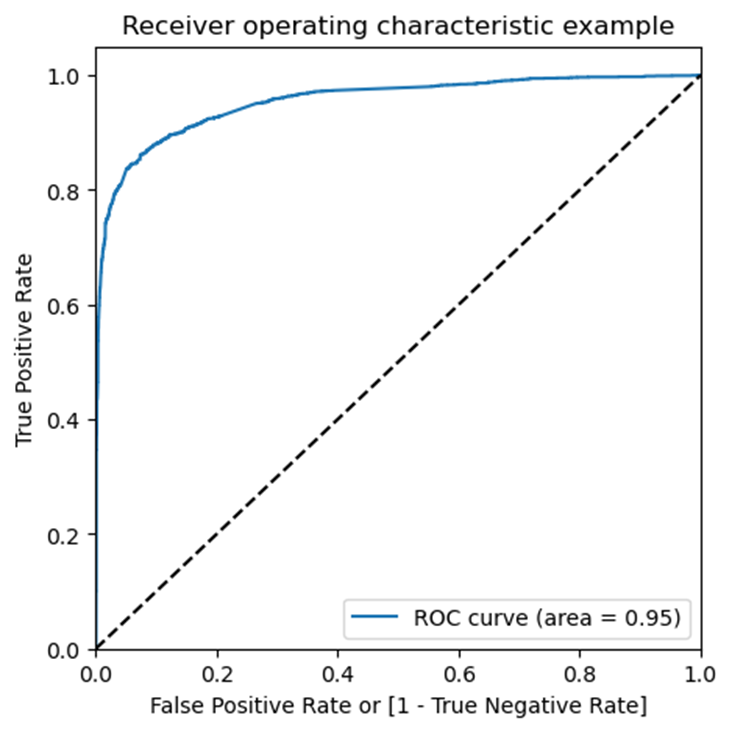
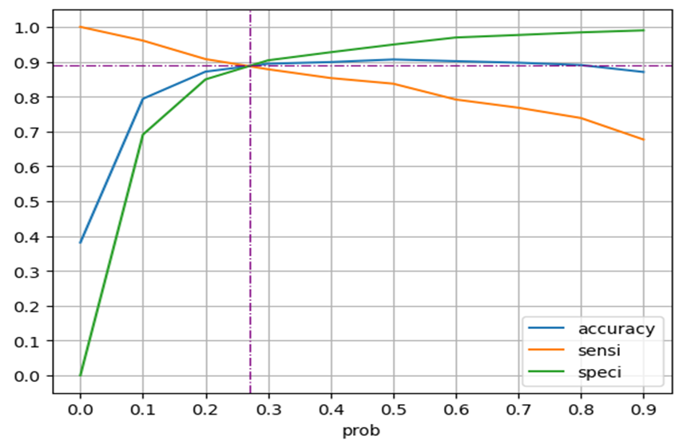
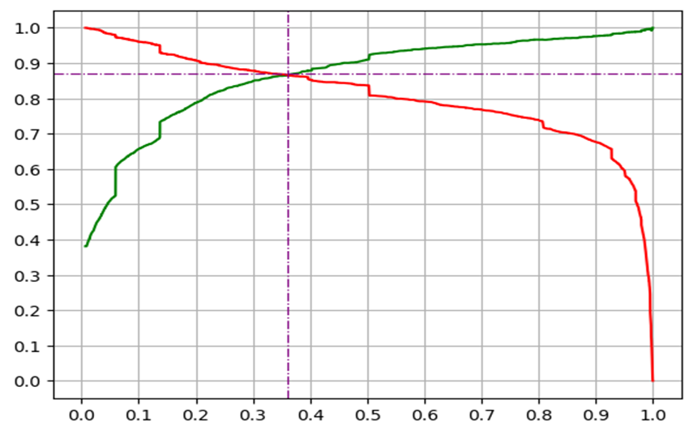

# Lead Scoring Logistic Regression
Lead scoring is a famous case study, where Logistic regression is used as a statistical model to estimate the probability that a lead will convert into a customer.
## Problem Statement
An education company named X Education sells online courses to industry professionals.
Company receive the leads from many sources like their own website, references, through marketing on various websites, search engines like Google, social media sites like YouTube, facebook etc.
Currently, conversion rate for these leads to actual customers is approximately 38%.

## Business Objective
- The aim of the study is to identify the leads that are most likely to convert into paying customers.
- Assign a lead score between 0 and 100 to each of the leads which can be used by the company to target potential leads.
- Handling special requirement for adjusting model to support:
  - Identify almost all of the potential leads during 2 months when additional manpower like Interns are available.
  - Identify strategy to minimize phone calls during times when company reaches its target for a quarter before the deadline.

## Steps of Lead Scoring Modelling
The aim of the study is to identify the leads that are most likely to convert into paying customers. Model will provide a lead score to each of lead in range from 0 to 100, where higher score indicates higher chances of lead to be converted. Steps taken during the assignment and learning at each step are as follows: -

- **Exploratory Data Analysis (EDA):**
  - _Data Cleaning – Missing Value Handling:_
    - 6 columns (including all Asymmetrique score/index and Lead profile/quality) are observed with missing values > 40% and marked inadequate for modelling.
    - Columns ‘City’ and ‘Country’ are dropped due to very high clubbed missing values and single category option like ‘Mumbai’ and ‘India’.
    - For ‘Specialization’, ‘Tags’, and 'What is your current occupation' categories options are restructured based on their distribution and are kept due to their good correlation with target variable.
    - Missing values are kept as ‘Unknown’ for ‘Specialization’, merged with one category for ‘Tags’, and proportionally distributed to all options for 'What is your current occupation'.
    - Mean and Mode is used for columns with low missing values.
  - _Data Cleaning – Understanding and Manipulation:_
    - ‘Last Activity’ and ‘Last Notable Activity' in dataset represent relatively similar information and later looks more relevant due to its notable factor and due to last activity (action) may be temporary & exactly opposite to lead's sentiments.
  - _Univariant analysis:_
    - Categorical Flags (Yes/No) Variables
      - Dropping columns where single value has > 99% occurrences.
    - Categorical Variables:
      - Clubbing low frequency categories in 'Lead Source', 'Last Notable Activity'.
    - Numerical Variables:
      - Outliers handling for columns 'TotalVisits', ‘Page Views Per Visit’.
  - _Multivariant Analysis:_
    - Dropping column 'TotalVisits' due to its high correlation with ‘Page Views Per Visit’.
- **Data Preparation:**
  - Replacing categorical variables with dummy variables and dropping selective one column.
  - Making column 'Lead Number' as index and dropping as column.
  - Splitting the Data into Training and Testing Sets in 70-30 ratio.
  - Rescaling the Numerical Features using Standard Scalar.
  - Finding correlation/Heatmap between all variables, and dropping variables with high correlation > 70%.
- **Building Model:**
  - Final dataset after cleaning and preparation consists of 19 variables.
  - In first logistic regression model using statsmodels, it is found that there exist variables with high p-value.
  - With multiple experiments using automatic feature selection (RFE), adequate 11 features have been selected, where all variables have p-value < 0.05 and VIF in range.
  - ROC plot show ROC curve area is 0.95, which is pretty good.
- **Model Evaluation:**

<table><tbody><tr><th></th><th>
<strong>Accuracy, sensitivity, and specificity balance</strong>

<strong>[Train Data]</strong>
</th><th>
<strong>Precision, and Recall Balance</strong>

<strong>[Train Data]</strong>

<strong>(Finally selected)</strong>
</th><th>
<strong>On Test Data</strong>
</th></tr><tr><td>
Optimal Cut-off
</td><td>
0.27
</td><td>
0.36
</td><td></td></tr><tr><td>
Confusion Matrix
<ul><li>True Positives (TP)</li><li>True Negatives (TN)</li><li>False Positives (FP)</li><li>False Negatives (FN)</li></ul></td><td><ul><li>2181</li><li>3571</li><li>431</li><li>285</li></ul></td><td><ul><li>2134</li><li>3669</li><li>333</li><li>332</li></ul></td><td><ul><li>949</li><li>1547</li><li>130</li><li>146</li></ul></td></tr><tr><td>
Accuracy
</td><td>
0.8893
</td><td>
0.8972
</td><td>
0.9004
</td></tr><tr><td>
Sensitivity
</td><td>
0.8844
</td><td>
0.8654
</td><td>
0.8667
</td></tr><tr><td>
Specificity
</td><td>
0.8923
</td><td>
0.9168
</td><td>
0.9225
</td></tr><tr><td>
Precision
</td><td>
0.8350
</td><td>
0.8650
</td><td>
0.8795
</td></tr><tr><td>
Recall
</td><td>
0.8844
</td><td>
0.8654
</td><td>
0.8667
</td></tr></tbody></table>

- **Factor affecting the Conversion Probability:**
  - Tags_Conversion_Chances_HIGH_CONVERSION_CHANCES
  - Last_Notable_Activity_SMS_Sent
  - Lead_Source_Direct_Traffic
  - Lead_Source_Organic_Search
  - Lead_Origin_Lead_Import
  - Lead_Source_Google
  - Lead_Source_Reference
  - Lead_Source_Olark_Chat
  - Total_Time_Spent_on_Website
  - Last_Notable_Activity_Email_Opened
  - Lead_Origin_Landing_Page_Submission

## Accuracy, sensitivity, and specificity Balance V/S Precision, and Recall Balance

| Accuracy, Sensitivity, and Specificity Balance | Precision, and Recall Balance |
| --- | --- |
| **Cut-Off – 0.27** | **Cut-Off – 0.36** |
|  |  |

Cut-off of 0.36 is chosen to convert the conversion probabilities to actual Converted Flag.

## Suggestions to increase focus on customers with higher conversion chances

To minimize the rate of useless phone calls, company may use following strategy:

- **_Model Adjustment and Enhancement:_**
  - _Increase the model cut-off probability to have higher ‘Precision’, which will return more relevant results, rather than irrelevant results._
  - Rebuild model frequently to use latest statistic and better results.
  - Making model from scratch, that may include exploring algorithms other than logistic regression, and use best model for better results.
- **_Additional Strategies to minimize useless calls:_**
  - Specifically target the leads that are already tagged to have high chances of conversion.
  - Follow-up through automated SMS service, and also try to reach new focused audience.
  - Enrich Website to support chatbot and multi-level questioning to get more in-depth information of landed audience and identify only highly interested audience.

Whenever phone service is used than choose the lead with higher ‘Lead Score’ at any stage.

# Important Links:
- [Python Code](./Lead_Scoring_Case_Study_Final.ipynb)
- [Power Point Presentation](./Lead_Scoring_Case_Study_Presentation_Final.pdf)
- [Lead Scoring Subjective Questions Response](./Lead_Scoring_Subjective_Questions_Response_Final.pdf)
- [Lead Scoring Summary](./Lead_Scoring_Summary_Final.pdf)
- [Dataset Used for study](./Leads.csv)
